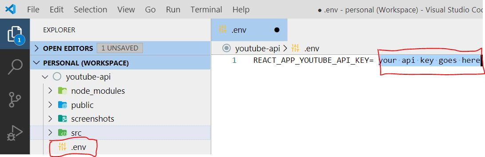
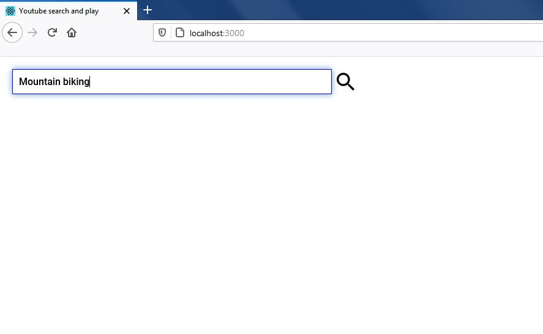
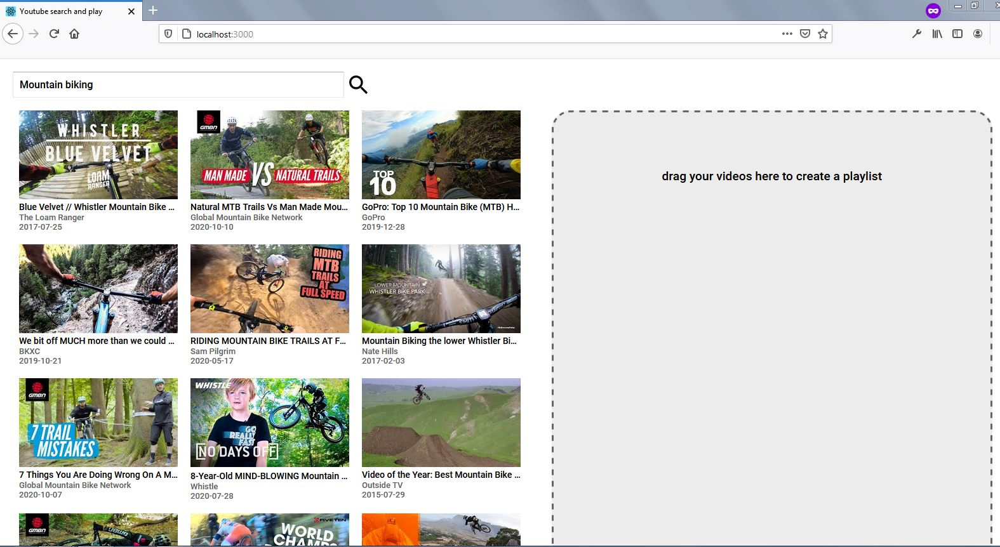
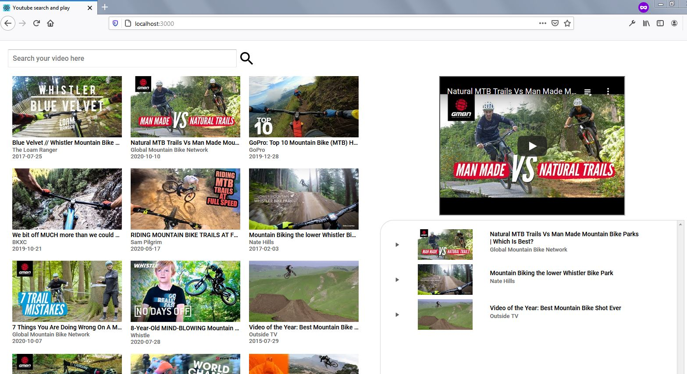

# Youtube search and play (Not finished yet)

A small project to start learning React. Still in progress.. 

It uses the youtube API v3 to search videos.

You need an API Key that you can get in https://console.developers.google.com/apis/api/youtube.googleapis.com

After you have your API key, you should create a .env file in your root folder and store your api key like this:

## Screenshots

___

___

## Todo

- [ ] Learn how to use properly the iframe video player api to add videos to the play list and keep the video player running.
- [ ] Write the logic to show the play button icon only for the current item that is being played 

